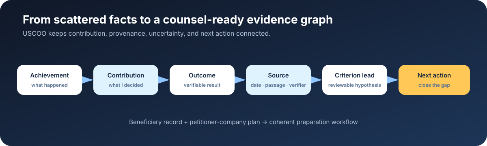

# USCOO

Open-source O-1A preparation workspace for founders filing through their own company and immigration professionals.

Turn scattered founder facts into an evidence graph, a petitioner-company work plan, reviewable drafts, and a counsel-ready record.



[Live Demo](https://www.uscoo.ai/?utm_source=github&utm_medium=referral&utm_campaign=open_source) · [60-second overview](docs/EVIDENCE_GRAPH.md#the-60-second-version) · [Golden Case #001-S](docs/GOLDEN_CASE_001-S.md) · [Citation](CITATION.cff) · [中文说明](#中文说明) · [Security](SECURITY.md) · [Contributing](CONTRIBUTING.md)

USCOO turns a founder's scattered achievements into a structured preparation workflow: assess evidence against the O-1A criteria, identify gaps, organize source material, coordinate the petitioner company, generate reviewable working drafts, and hand a coherent record to counsel.

> USCOO is preparation software, not a law firm. It does not provide legal advice or guarantee eligibility, filing, or approval. Confirm current forms, fees, filing addresses, and case strategy with USCIS and qualified counsel.

## Start here

In 60 seconds:

1. Start with one concrete achievement.
2. Separate the founder's personal decision and contribution from the team's result.
3. Link each claim to a source, date, page or passage, and verification status.
4. Map the evidence to the O-1A criteria and identify what is missing.
5. Continue with a founder-led filing through the petitioning company or prepare a counsel handoff.

### Choose your path

- **Founder** — [open the Live Demo](https://www.uscoo.ai/) and see the guided assessment before creating a workspace.
- **Immigration professional** — read the [Golden Case #001-S](docs/GOLDEN_CASE_001-S.md) and the [Evidence Graph note](docs/EVIDENCE_GRAPH.md).
- **Developer** — run the fictional test case locally with the [Quick start](#quick-start), then review the [Architecture](docs/ARCHITECTURE.md) and [Deployment](docs/DEPLOYMENT.md).

The repository contains only fictional or synthetic examples. Do not add real applicant records, identity documents, credentials, or production exports.

## What v0.1 includes

- A bilingual English/Chinese founder assessment.
- Evidence mapping across the eight regulatory O-1A criteria.
- Case workspace, timeline, task gates, audit history, and versioned records.
- Company/petitioner preparation and filing-readiness checklists.
- File intake, DOCX/PDF extraction, draft generation, and ZIP export.
- Counsel handoff, expiring share links, support intake, and admin review.
- Optional OpenAI-assisted drafting and optional Resend email delivery.
- D1 persistence and R2 object storage for a Sites-hosted deployment.

## Intended users

- Founders translating non-U.S. achievements into evidence that a U.S. reviewer can verify.
- Self-directed applicants who need structure before engaging counsel.
- Immigration firms exploring transparent, human-reviewed AI workflows.
- Builders researching evidence-centered legal operations software.

## Why Evidence Graph?

An O-1A preparation record is not just a resume or a checklist. It connects achievements, personal contribution, outcomes, sources, petitioner facts, work arrangements, criteria, open questions, and filing events. USCOO makes those relationships explicit so a founder, reviewer, and counsel can inspect the same facts without silently turning an unverified claim into a legal conclusion.

Read the technical note: [O-1A Preparation as an Evidence Graph](docs/EVIDENCE_GRAPH.md).

## Quick start

Requirements: Node.js 22.13+ and pnpm.

```bash
git clone https://github.com/zhuangsirandy/uscoo.git
cd uscoo
pnpm install
cp .env.example .env.local
pnpm dev
```

The public assessment and marketing experience run without third-party API keys. The authenticated case workspace is designed for **ChatGPT Sites hosting** and trusts Sites-provided authentication headers. It also expects the `DB` D1 and `BUCKET` R2 bindings declared in `.openai/hosting.json`.

Authenticated workspace access fails closed unless the Sites runtime sets `USCOO_SITES_AUTH_TRUSTED=true`. Never set this flag on a generic Cloudflare, Vercel, or other public deployment; replace the authentication adapter with a server-verified identity system first.

For a complete backend verification without a hosted account:

```bash
pnpm build
pnpm test
```

The integration suite starts isolated local D1/R2 resources and uses synthetic identities only.

## Platform boundary

v0.1 is source-available as a complete product snapshot, but its deployment adapter is intentionally Sites-specific:

- `app/chatgpt-auth.ts` reads authenticated-user headers injected by Sites.
- The workspace accepts those headers only when `USCOO_SITES_AUTH_TRUSTED=true` is present in the trusted Sites runtime.
- `lib/case-store.ts` reads D1, R2, and runtime values from Cloudflare bindings.
- `.openai/hosting.json` contains placeholder binding names and **no production project ID**.

To run the workspace on another platform, replace the authentication adapter and provide equivalent SQL/object-storage bindings. See [Deployment](docs/DEPLOYMENT.md) and [Architecture](docs/ARCHITECTURE.md).

## Configuration

| Variable               |   Required | Purpose                                                       |
| ---------------------- | ---------: | ------------------------------------------------------------- |
| `OPENAI_API_KEY`       |         No | Enables AI-assisted drafting.                                 |
| `OPENAI_MODEL`         |    With AI | Model used by the drafting service.                           |
| `MODEL_DAILY_LIMIT`    |         No | Per-project daily model-call ceiling; default `20`.           |
| `RESEND_API_KEY`       |         No | Enables transactional email.                                  |
| `USCOO_EMAIL_FROM`     | With email | Verified sender, for example `USCOO <reports@example.org>`.   |
| `USCOO_ADMIN_USER_IDS` |  For admin | Comma-separated authenticated user IDs allowed into `/admin`. |

Never commit `.env`, applicant documents, database exports, production IDs, or credentials.

## Repository map

```text
app/             routes, APIs, auth boundary, metadata
components/      product and UI components
db/              Drizzle schema
drizzle/         D1 migrations
lib/             domain, storage, documents, AI and validation
scripts/         integration and translation checks
docs/            architecture, deployment, privacy and release notes
examples/        fictional, non-production sample data
```

## Development

```bash
pnpm lint
pnpm format --check
pnpm build
pnpm test
```

Open a focused issue before a large change. Do not place real immigration records or personal data in issues, pull requests, fixtures, screenshots, or logs.

## 中文说明

USCOO 是面向创始人、个人准备者与移民专业人士的 O-1A 申请准备工作台。它帮助用户将分散的成就与证据映射到八项标准，识别证据缺口，管理申请公司、时间线、工作稿与律师交接。

本项目不提供法律意见，也不替代持牌律师。开源的意义是让证据组织、流程设计和 AI 辅助工作方式可以被审阅、复用和共同改进；真实个案资料不得提交到 GitHub。

## License

Code is licensed under the [Apache License 2.0](LICENSE). The license does not grant permission to imply endorsement by USCOO or to misuse USCOO branding; see [TRADEMARKS.md](TRADEMARKS.md).
