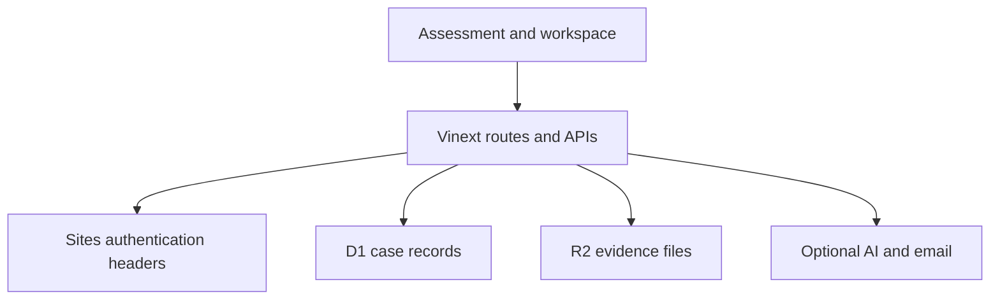

# Architecture

USCOO is a Vinext/React application packaged for Cloudflare-compatible execution through ChatGPT Sites.

## Trust boundaries

1. **Authentication** — `app/chatgpt-auth.ts` and API helpers trust only headers injected by Sites. A reverse proxy must strip user-supplied copies of those headers.
2. **Authorization** — records are scoped by authenticated user ID; share links use hashed, expiring tokens.
3. **Structured data** — D1 stores accounts, cases, evidence metadata, audit entries, analytics events, leads, support requests, and email jobs.
4. **Objects** — R2 stores uploaded source files. File downloads are checked against the case owner or share capability.
5. **AI** — model use is optional and consent-gated. Drafting output remains a working draft and does not replace source evidence or human review.
6. **Email** — Resend is optional. Delivery credentials remain server-side and are not required for core assessment flows.

## Important modules

| Module                             | Responsibility                                                 |
| ---------------------------------- | -------------------------------------------------------------- |
| `lib/case-domain.ts`               | Core records, criteria, gates, and official-source links.      |
| `lib/case-store.ts`                | D1/R2 bindings, identity, errors, ownership helpers.           |
| `lib/case-agent.ts`                | Optional model calls, limits, and provider handling.           |
| `lib/case-documents.ts`            | File metadata, extraction, and generated documents.            |
| `app/api/uscoo/[...path]/route.ts` | Main authenticated case API.                                   |
| `scripts/test-cases.mjs`           | Isolated D1/R2 integration coverage with synthetic identities. |

## Porting to another host

Replace the Sites auth adapter, inject verified identity server-side, and implement equivalents for D1/R2 bindings. Do not expose the authenticated routes until tenant-isolation tests pass on the target platform.
