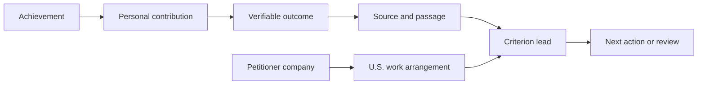

# O-1A Preparation as an Evidence Graph

USCOO is built around a simple idea: an O-1A preparation record should be inspectable as a graph of facts and sources, not only as a resume or a flat checklist.

## The 60-second version

An achievement becomes useful preparation data only when the system can answer:

- What happened?
- What did the founder personally decide or contribute?
- What result followed?
- Who or what can verify it?
- Which O-1A criterion might it support?
- What remains unverified or missing?
- How does it connect to the petitioning company and proposed U.S. work?

The graph preserves those relationships. It does not decide eligibility and it does not replace legal judgment.

## The model

The important distinction is between a result and the founder's contribution to that result. A strong preparation record keeps both nodes and asks for evidence for each.

## Why a graph is better than a checklist

### 1. It preserves provenance

A statement can be traced to an issuer, date, page, passage, original file, translation state, and verification status. This makes later drafting reviewable.

### 2. It prevents contribution inflation

Team performance, company revenue, customer adoption, and press coverage do not automatically prove what one person personally did. The graph stores the personal decision separately from the team outcome.

### 3. It exposes missing links

The missing item may not be another document. It may be a missing date, a weak independent source, an unclear petitioner relationship, or an unsupported connection between the achievement and the proposed U.S. work.

### 4. It supports multiple collaborators

Founders, immigration professionals, translators, and reviewers can work from the same source-linked facts while keeping unverified claims visibly marked.

## Open-source boundary

This repository demonstrates the evidence-centered workflow, data model, validation rules, synthetic fixtures, and deployment boundary. It does not include real applicant records, production credentials, private case data, or a substitute for advice from qualified counsel.

## Questions for contributors

- What is the smallest useful evidence graph for a founder's first achievement?
- Which provenance fields make counsel review faster without creating unnecessary data collection?
- How should a graph represent conflicting sources or a later correction?
- Which parts should remain deterministic and which parts may receive optional AI assistance?

Open an issue or discussion with a fictional example. Please do not upload real immigration records.
