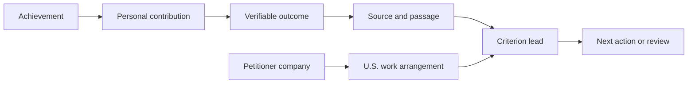

# O-1A Preparation as an Evidence Graph

USCOO is built around a simple idea: an O-1A preparation record should be inspectable as a graph of facts and sources, not only as a resume or a flat checklist.

## The 60-second version

An achievement becomes useful preparation data only when the system can answer:

- What happened?
- What did the founder personally decide or contribute?
- What result followed?
- Who or what can verify it?
- Which O-1A criterion might it support?
- What remains unverified or missing?
- How does it connect to the petitioning company and proposed U.S. work?

The graph preserves those relationships. It does not decide eligibility and it does not replace legal judgment.

## v0.2 schema direction

The v0.2 direction makes the audit trail explicit while remaining compatible with the existing JSON record envelope. Existing records can continue to live in `records.body`; a graph is an additive structure inside a record, not a destructive replacement.

```text
SourceArtifact ──observed by──> Observation ──grounds──> Assertion
                                                        │
                                                        └──checked by──> VerificationActivity

Assertion ──supports / contradicts / supersedes──> Assertion
```

### SourceArtifact

Describes where a record came from. Useful provenance fields include a stable locator, immutable content digest, producer, published and observed timestamps, extraction method/version, schema version, import run ID, redaction status, and chain-of-custody note.

### Observation

Describes what was actually seen in a source, including a page, passage, table, timestamp, observer, and method. An observation is not an interpretation.

### Assertion

Expresses a claim about a person, company, achievement, outcome, or relationship. Its `basis` must distinguish `source-observed`, `founder-statement`, and `model-inferred`. A founder statement is a lead, never an automatic finding.

Assertions may be `unresolved`, `supported`, `contested`, or `superseded`. Conflicting assertions remain separate and are connected with explicit `supports`, `contradicts`, or `supersedes` relations. The system must not replace a prior assertion with a confidence score.

### VerificationActivity

Represents one verification event attached to an assertion—not to the source alone. It records the verifier, method, policy or criterion, result, time, scope, and limitations. If two verification activities disagree, both remain in history and the assertion stays `unresolved` until an explicit decision is recorded.

The optional `currentEffectiveVerificationId` on an assertion identifies the verification currently used for a working view. It never deletes or hides other verification activities and requires an `effectiveReason`, `effectiveAt`, and decision record.

The reference implementation is [`lib/evidence-graph.ts`](../lib/evidence-graph.ts), and the fictional conflicting-review fixture is in [`examples/fictional-founder-intake.json`](../examples/fictional-founder-intake.json).

## Compatibility and migration policy

- v0.1 records remain readable without a graph.
- v0.2 graph fields are additive and versioned with `schemaVersion: "0.2"`.
- Existing `record_versions` and audit entries remain authoritative history.
- No migration may delete, overwrite, or collapse a prior assertion or verification.
- AI-generated fields must remain visibly separate from source-observed fields.
- Structural validation confirms relationships; it does not make a legal conclusion or confirm eligibility.

## The model



The important distinction is between a result and the founder's contribution to that result. A strong preparation record keeps both nodes and asks for evidence for each.

## Why a graph is better than a checklist

### 1. It preserves provenance

A statement can be traced to an issuer, date, page, passage, original file, translation state, and verification status. This makes later drafting reviewable.

### 2. It prevents contribution inflation

Team performance, company revenue, customer adoption, and press coverage do not automatically prove what one person personally did. The graph stores the personal decision separately from the team outcome.

### 3. It exposes missing links

The missing item may not be another document. It may be a missing date, a weak independent source, an unclear petitioner relationship, or an unsupported connection between the achievement and the proposed U.S. work.

### 4. It supports multiple collaborators

Founders, immigration professionals, translators, and reviewers can work from the same source-linked facts while keeping unverified claims visibly marked.

## Open-source boundary

This repository demonstrates the evidence-centered workflow, data model, validation rules, synthetic fixtures, and deployment boundary. It does not include real applicant records, production credentials, private case data, or a substitute for advice from qualified counsel.

## Questions for contributors

- What is the smallest useful evidence graph for a founder's first achievement?
- Which provenance fields make counsel review faster without creating unnecessary data collection?
- How should a graph represent conflicting sources or a later correction?
- When repeated verifications disagree, which explicit facts are required before a reviewer may designate one as currently effective?
- Which parts should remain deterministic and which parts may receive optional AI assistance?

Open an issue or discussion with a fictional example. Please do not upload real immigration records.
